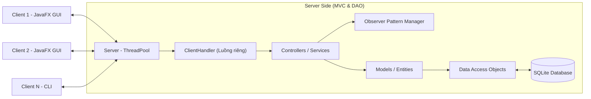

# BÁO CÁO HỆ THỐNG ĐẤU GIÁ TRỰC TUYẾN

## 1. Giới thiệu mục tiêu và phạm vi thực hiện
- **Mục tiêu:** Xây dựng một hệ thống đấu giá trực tuyến hoạt động theo mô hình Client-Server phục vụ nhu cầu trao đổi, mua bán sản phẩm qua hình thức đấu giá thời gian thực.
- **Phạm vi thực hiện:** Hệ thống hỗ trợ đa nền tảng thông qua Java. Quản lý đồng thời nhiều client tham gia đấu giá thông qua đa luồng (Multithreading) trên Server, lưu trữ trạng thái người dùng, số dư ví, danh sách sản phẩm và lịch sử đặt giá một cách an toàn.

## 2. Kiến trúc tổng thể của hệ thống
Kiến trúc hệ thống được thiết kế theo mô hình **Client-Server** rõ ràng, giao tiếp qua TCP Socket, kết hợp với mô hình **MVC** (Model-View-Controller) trên cả Client và Server.

**Mô tả kiến trúc:**

- **Client:** Sử dụng JavaFX và FXML để tách biệt giao diện với logic điều khiển (MVC). Gửi các request (Đăng nhập, Bid, Tạo phiên) đến Server.
- **Server:** Lắng nghe kết nối TCP. Sử dụng `ExecutorService` (ThreadPool) tạo Thread riêng (ClientHandler) cho mỗi Client, đảm bảo không nghẽn mạng.
- **Mô hình Dữ liệu:** Sử dụng DAO Pattern để truy xuất dữ liệu từ SQLite. Service Layer chứa logic nghiệp vụ, gọi DAO để lưu/đọc dữ liệu.
- **Real-time:** Áp dụng Observer Pattern để broadcast thông tin cập nhật giá mới ngay lập tức cho các Client qua kết nối Socket.

## 3. Chức năng đạt được theo Barem và Hướng giải quyết

### 3.1. Thiết kế lớp và cây kế thừa (OOP & Design Pattern)
- **Tính năng đạt được:** Xác định đầy đủ các lớp chính như `User` (kế thừa ra `Admin`, `Seller`, `Bidder`), `Item`, `Auction`, `BidTransaction`. Áp dụng tính Đóng gói (Encapsulation), Kế thừa (Inheritance) và Đa hình (Polymorphism).
- **Hướng giải quyết & Lý do:** 
  - *OOP:* Mọi thuộc tính lớp Model được đặt `private` và truy xuất qua `getter/setter`. Khai báo interface cho các Service và DAO (Abstraction). 
  - *Design Pattern:* 
    - **Observer Pattern:** Dùng để quản lý thông báo Real-time (Server đóng vai trò Subject, ClientHandlers là Observers). Giải pháp này giúp tách biệt logic xử lý với logic cập nhật giao diện, tối ưu băng thông (chỉ push dữ liệu khi có thay đổi).
    - **DAO Pattern:** Tách biệt code truy cập database khỏi business logic.

### 3.2. Chức năng chính & Xử lý ngoại lệ
- **Tính năng đạt được:** Quản lý người dùng/sản phẩm (Đăng nhập, Đăng ký, Tạo phiên đấu giá). Chức năng đấu giá (Đặt giá, kết thúc phiên). Xử lý ngoại lệ (Exception Handling).
- **Hướng giải quyết & Lý do:** 
  - Dữ liệu người dùng, ví tiền, phiên đấu giá được lưu trữ persistent trên bảng `users`, `auctions`, `bids` của SQLite.
  - Các lỗi như nhập sai định dạng, đặt giá thấp hơn giá hiện tại, hoặc mất kết nối mạng đều được try-catch và ném ra các `CustomException` (ví dụ: `InvalidBidException`). Client sẽ nhận mã lỗi và hiển thị Dialog cảnh báo thân thiện (Alert JavaFX).

### 3.3. Kỹ thuật quan trọng & Concurrency (Đồng thời)
- **Tính năng đạt được:** Xử lý đấu giá đồng thời an toàn (tránh race condition, lost update). Real-time update thông báo bid mới cho mọi client.
- **Hướng giải quyết & Lý do:**
  - *An toàn đồng thời:* Khi Client gửi lệnh Bid, Server đưa logic cập nhật database và kiểm tra giá vào một khối `synchronized` block hoặc sử dụng `ReentrantLock` theo `auction_id`. Điều này đảm bảo nếu có 100 người đặt giá cùng lúc vào một món hàng, hệ thống xử lý tuần tự từng người, không bị ghi đè (lost update) hay sai lệch số dư ví. Hệ thống cũng dùng cơ chế Transaction (Rollback) của SQLite.
  - *Realtime Socket:* Ngay khi xử lý xong một request Bid hợp lệ, Server gọi `notifyObservers()` để đẩy gói tin cập nhật xuống toàn bộ Client đang mở xem phiên đấu giá đó, giúp giao diện cập nhật ngay lập tức.

### 3.4. Tích hợp, kiến trúc và chất lượng mã
- **Tính năng đạt được:** Kiến trúc Client-Server, MVC, dùng Maven, Unit Test (JUnit).
- **Hướng giải quyết:**
  - Dự án build bằng Maven (pom.xml), tuân thủ Java Naming Conventions, code sạch.
  - Các logic nghiệp vụ cốt lõi (kiểm tra mật khẩu, logic hợp lệ hóa giá bid) được viết Unit Test bằng **JUnit 5**, đảm bảo hệ thống vận hành đúng quy tắc sau mỗi lần thay đổi mã.

### 3.5. Chức năng nâng cao (Tùy chọn)
- **Tính năng đạt được:** Lịch sử đấu giá thời gian thực, Biểu đồ, Auto-bidding, Anti-sniping, Biểu đồ giá
- **Hướng giải quyết:** Bổ sung JavaFX LineChart trên giao diện Client, lắng nghe luồng dữ liệu Realtime từ Server để vẽ lại đường giá theo thời gian mà không cần tải lại trang.

## 4. Phân chia công việc giữa các thành viên

| STT | Họ và Tên | Vai trò | Mô tả công việc chi tiết |
|---|---|---|---|
| 1 | Roãn Thanh Tùng | Trưởng nhóm / Database | **Quản lý dự án:** Lên kế hoạch, điều phối và phân công nhiệm vụ cho các thành viên.   **Database:** Thiết kế sơ đồ quan hệ (ERD), khởi tạo và quản trị cơ sở dữ liệu SQLite.   **Document:** Soạn thảo tài liệu kỹ thuật (README), xây dựng kịch bản và thực hiện Video Demo tổng quan. |
| 2 | Nguyễn Văn Phúc | Frontend Developer (JavaFX) | **Thiết kế UI/UX:** Xây dựng toàn bộ giao diện người dùng bằng JavaFX (FXML).   **Client Logic:** Liên kết Controller, xử lý luồng sự kiện giao diện, tích hợp tính năng gửi/nhận dữ liệu trực quan giúp nâng cao trải nghiệm người dùng. |
| 3 | Đặng Văn Thành | Core Backend Developer | **Core System:** Phát triển kiến trúc Client-Server đa luồng (ThreadPool, Socket).   **Business Logic:** Viết các service xử lý nghiệp vụ cốt lõi: Quản lý đăng nhập, khởi tạo/đóng phiên đấu giá, và logic xác thực gói tin Bid an toàn. |
| 4 | Trịnh Việt Anh | Advanced Feature Developer | **Chức năng nâng cao:** Nghiên cứu và triển khai thuật toán Đấu giá tự động (Auto-bidding) sử dụng PriorityQueue, cơ chế chống bắn tỉa (Anti-sniping).   **Realtime Data:** Xử lý luồng dữ liệu cho biểu đồ đường giá theo thời gian thực (Bid History Visualization). |
